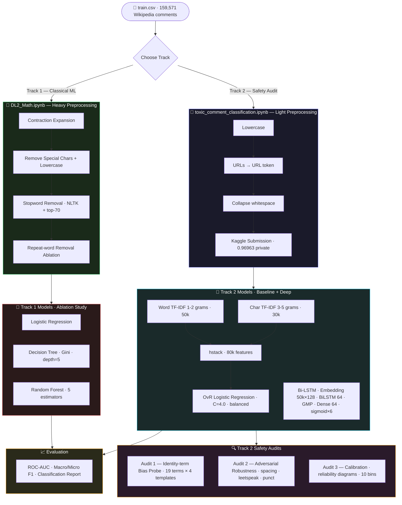

<!-- ████████████████████████████████  HEADER  ████████████████████████████████ -->

<div align="center">


</div>

<!-- ████████████████████████████████  TYPING  ████████████████████████████████ -->

<div align="center">

[](https://git.io/typing-svg)

</div>

<br/>

<!-- ████████████████████████████████  BADGES  ████████████████████████████████ -->

<div align="center">

[](https://python.org)
[](https://tensorflow.org)
[](https://scikit-learn.org)
[](https://www.kaggle.com/c/jigsaw-toxic-comment-classification-challenge)
[](.)
[](.)
[](.)

</div>

<br/>

---

<!-- ████████████████████████████████  ABOUT  ████████████████████████████████ -->

## 🧠 What This Repository Contains

This repository is a **unified study** of the Kaggle *Jigsaw Toxic Comment Classification Challenge (2018)*, covering two complementary bodies of work:

```python
class JigsawToxicCommentClassifier:
    def __init__(self):
        self.author   = "Anisha Singla"
        self.college  = "George Brown College"
        self.task     = "Multi-label binary classification — 6 toxicity categories"
        self.labels   = ["toxic", "severe_toxic", "obscene",
                         "threat", "insult", "identity_hate"]

    @property
    def track_1_classical(self):
        return {
            "course"     : "T431 — Advanced Mathematics for Machine Learning 2",
            "notebook"   : "DL2_Math.ipynb",
            "models"     : ["Logistic Regression", "Decision Tree", "Random Forest"],
            "ablation"   : "Repeat-word removal vs. keeping repeats",
            "best_score" : "0.96963 Kaggle private leaderboard",
        }

    @property
    def track_2_safety(self):
        return {
            "focus"      : "Failure-mode analysis — deployment safety",
            "notebook"   : "toxic_comment_classification.ipynb",
            "models"     : ["TF-IDF + OvR Logistic Regression", "Bi-LSTM"],
            "audits"     : ["Identity-term bias", "Adversarial robustness", "Calibration"],
        }
```

> Two notebooks. One problem statement. Classical ML with a rigorous ablation study **plus** a deep model with a safety-evaluation discipline. Headline accuracy is necessary — but not sufficient.

---

<!-- ████████████████████████████████  LABELS  ████████████████████████████████ -->

## 🏷️ Classification Labels

<div align="center">

| Label | Meaning | Type |
|:---:|:---|:---:|
| 🔴 `toxic` | Generally toxic content | Binary |
| 🚨 `severe_toxic` | Extremely abusive language | Binary |
| 🤬 `obscene` | Profane or vulgar content | Binary |
| ⚠️ `threat` | Threatening language | Binary |
| 💢 `insult` | Insulting or degrading content | Binary |
| 🎯 `identity_hate` | Hate based on identity (race, gender, religion, etc.) | Binary |

</div>

> Each comment receives an independent `0` or `1` per label — a single comment can trigger multiple categories simultaneously.

---

<!-- ████████████████████████████████  DATASET  ████████████████████████████████ -->

## 📊 Dataset — Jigsaw Toxic Comment Classification (2018)

<div align="center">

| Split | Rows | Notes |
|:---:|:---:|:---|
| 🟢 `train.csv` | **159,571** | Fully labelled Wikipedia talk-page comments |
| 🔵 `test.csv` | **153,164** | Kaggle leaderboard evaluation set |
| 🟡 `test_labels.csv` | 153,164 | `-1` = excluded from scoring · `0/1` = actual labels (committed under `TermProject/`) |

</div>

**Columns:** `id` · `comment_text` · `toxic` · `severe_toxic` · `obscene` · `threat` · `insult` · `identity_hate`

**Class imbalance:** The `toxic` label appears in ~10% of training rows. `threat` and `identity_hate` each appear in under 1%. Handled via `class_weight='balanced'` in the Logistic Regression baseline and via ablation analysis in the classical track.

✅ No missing values in the dataset.

[](https://www.kaggle.com/c/jigsaw-toxic-comment-classification-challenge)
[](https://drive.google.com/drive/folders/19ypMvTk14-cDmVKd8wnKyTDLJrqiAK8X?usp=sharing)

---

<!-- ████████████████████████████████  PIPELINE  ████████████████████████████████ -->

## 🔁 Unified Pipeline Across Both Notebooks



---

<!-- ████████████████████████████████  TRACK 1  ████████████████████████████████ -->

## 📘 Track 1 — Classical ML & Ablation Study

**Notebook:** `DL2_Math.ipynb`
**Course context:** *T431 — Advanced Mathematics for Machine Learning 2* · George Brown College

### Approach

| Stage | Detail |
|:---|:---|
| Preprocessing | Contraction expansion → special-char removal → lowercase → stopword removal (NLTK + top-70 from `CountVectorizer`) |
| Feature extraction | TF-IDF vectorization · `max_features = 5,000` |
| Split | 80 / 20 train / validation |
| Models | Logistic Regression · Decision Tree (Gini, depth=5) · Random Forest (5 estimators) |
| Ablation variable | `remove_repeat` column — repeat-word removal vs. keeping repeats |

### Ablation Results

<div align="center">

| Model | Variant A — Allow Repeats | Variant B — Remove Repeats |
|:---|:---:|:---:|
| 📘 Logistic Regression | ✅ Trained | ✅ Trained |
| 🌿 Decision Tree | ✅ Trained | ✅ Trained |
| 🌲 Random Forest | ✅ Trained | ✅ Trained |

</div>

All six configurations are evaluated per-label and aggregated into an `accuracy_data` dict for side-by-side comparison across the six toxic categories.

### Kaggle Result

<div align="center">

| Model | Kaggle Private Score |
|:---|:---:|
| 🥇 **Logistic Regression** | **0.96963** |
| 🌿 Decision Tree | — |
| 🌲 Random Forest | — |

</div>

> A well-tuned linear model on sparse TF-IDF features outperforms more complex tree-based approaches on this task — an empirical confirmation of the linear-separability bias of high-dimensional text.

---

<!-- ████████████████████████████████  TRACK 2  ████████████████████████████████ -->

## 🛡️ Track 2 — Bi-LSTM & Safety Audits

**Notebook:** `toxic_comment_classification.ipynb`
**Focus:** Treat the classifier as a **safety artifact**, not a leaderboard entry.

### Model 1 — TF-IDF + One-vs-Rest Logistic Regression

```python
tfidf_word = TfidfVectorizer(sublinear_tf=True, analyzer='word',
                              ngram_range=(1, 2), max_features=50_000, min_df=3)
tfidf_char = TfidfVectorizer(sublinear_tf=True, analyzer='char_wb',
                              ngram_range=(3, 5), max_features=30_000, min_df=3)

X = hstack([tfidf_word, tfidf_char])   # 80k feature sparse matrix

lr = OneVsRestClassifier(
    LogisticRegression(C=4.0, solver='liblinear', max_iter=1000,
                       class_weight='balanced'), n_jobs=-1
)
```

> Combining word and char n-grams gives the baseline structural robustness against leetspeak and character-spacing attacks — the char-gram features partially overlap with the perturbed tokens.

### Model 2 — Bidirectional LSTM

```
Embedding(50000, 128, input_length=200)
    ↓
SpatialDropout1D(0.3)
    ↓
Bidirectional(LSTM(64, return_sequences=True))
    ↓
GlobalMaxPool1D()
    ↓
Dense(64, activation='relu') + Dropout(0.4)
    ↓
Dense(6, activation='sigmoid')   ← independent probability per label
```

```python
model.compile(
    optimizer = Adam(1e-3),
    loss      = 'binary_crossentropy',
    metrics   = [AUC(name='auc', multi_label=True)]
)
# EarlyStopping(monitor='val_auc', mode='max', patience=2, restore_best_weights=True)
```

> Captures word order and sequential context — crucial for sarcasm and negation, where bag-of-words models fail silently.

---

<!-- ████████████████████████████████  AUDITS  ████████████████████████████████ -->

## 🔍 Safety Audits (Track 2)

### Audit 1 — Identity-Term Bias Probe

<div align="center">

| Identity Group | Terms Tested |
|:---|:---|
| Sexual orientation | gay · lesbian · bisexual · transgender · queer |
| Religion | muslim · jewish · christian · hindu · atheist |
| Race / ethnicity | black · white · asian · latino · indigenous |
| Gender / other | woman · man · immigrant · disabled |

</div>

**Method:** Each of the 19 identity terms inserted into 4 clearly non-toxic templates:

```
"I am a {term} person and I love coffee."
"My best friend is {term}."
"She is a proud {term} scientist."
"As a {term} student I enjoy reading books."
```

Both models score all 76 probe texts. Mean `P(toxic)` per identity term is plotted as a horizontal bar chart against the 0.5 decision-threshold reference.

> Any bar above 0 indicates the model has learned a **spurious association** between the identity word and toxicity — the canonical Jigsaw failure mode documented by Dixon et al. (AIES 2018).

### Audit 2 — Adversarial Robustness

500 known-toxic validation comments perturbed three ways:

<div align="center">

| Perturbation | Example | Technique |
|:---|:---|:---|
| Character spacing | `i d i o t` | Split every character with spaces |
| Leetspeak | `1d10t` | `a→4 e→3 i→1 o→0 s→5 t→7` |
| Punctuation injection | `i.d.i.o.t` | Join every character with `.` |

</div>

Recall drop from the original baseline = attack-surface estimate. Char n-gram features give the TF-IDF baseline a structural advantage the Bi-LSTM lacks.

### Audit 3 — Calibration

`sklearn.calibration.calibration_curve` (10 bins) on the `toxic` head for both models. Reliability diagrams plotted against the perfect-calibration diagonal.

> If a model outputs `P(toxic) = 0.8` but only 50% of those comments are truly toxic, any moderation policy thresholding on that probability is operating on false confidence.

---

<!-- ████████████████████████████████  PREPROCESSING  ████████████████████████████████ -->

## 🧹 Preprocessing Philosophy — Why the Two Tracks Differ

<div align="center">

| Operation | Track 1 (Classical) | Track 2 (Safety) | Reason for Track-2 Choice |
|:---|:---:|:---:|:---|
| Lowercase | ✅ | ✅ | Normalisation |
| Contraction expansion | ✅ | ❌ | Minimal preprocessing preserves signal |
| Strip URLs → `URL` token | ❌ | ✅ | Remove noise, keep token |
| Collapse whitespace | ✅ | ✅ | Clean tokenisation |
| Remove punctuation | ✅ | ❌ | `!` `?` are toxicity signals |
| Stopword removal | ✅ | ❌ | Negation (`not bad`) changes meaning |
| Stemming / lemmatization | ❌ | ❌ | Char n-grams handle morphology |
| Repeat-word removal | ✅ *(as ablation)* | ❌ | Deliberately tested, then discarded |

</div>

> Track 1 performs **heavy preprocessing** and quantifies its effect via ablation. Track 2 does **minimal preprocessing** because aggressive cleaning removes the very features a toxicity classifier depends on. Both positions are defensible — and contrasting them is the point of having both notebooks in one repo.

---

<!-- ████████████████████████████████  MATH  ████████████████████████████████ -->

## 📐 Key Mathematical Concepts

<div align="center">

| Concept | Application |
|:---|:---|
| **TF-IDF** | Sparse term-frequency × inverse-document-frequency weighting |
| **Char n-grams (`char_wb`)** | Robustness to leetspeak, spacing, and morphological variation |
| **Logistic Regression** | Log-odds model with sigmoid · `class_weight='balanced'` for imbalance |
| **Gini Impurity** | Decision-tree split criterion |
| **Random Forest / Bagging** | Ensemble of decorrelated trees — variance reduction |
| **One-vs-Rest** | Six independent binary classifiers for the multi-label head |
| **Embedding + Bi-LSTM** | Learned 128-dim token vectors · bidirectional context modelling |
| **GlobalMaxPool1D** | Position-invariant feature selection across the sequence |
| **ROC-AUC · F1 · Calibration** | Evaluation beyond raw accuracy |
| **Stratified 80/20 & 90/10 Splits** | Holdout validation preserving class balance |

</div>

---

<!-- ████████████████████████████████  TECH  ████████████████████████████████ -->

## 🛠️ Tech Stack

<div align="center">

[](.)

| Library | Role |
|:---|:---|
| `numpy` · `pandas` | Numerical ops · data loading |
| `scikit-learn` | TF-IDF · Logistic Regression · Decision Tree · Random Forest · calibration · metrics |
| `scipy` | `hstack` for sparse TF-IDF combination |
| `tensorflow / keras` | Tokenizer · pad_sequences · Embedding · Bi-LSTM · EarlyStopping |
| `nltk` | Tokenization · stopword corpus (Track 1) |
| `matplotlib` · `seaborn` | Plotting · heatmaps |
| `missingno` · `wordcloud` | EDA (Track 1) |
| `jupyter` | Notebook runtime |

</div>

---

<!-- ████████████████████████████████  STRUCTURE  ████████████████████████████████ -->

## 🗂️ Repository Structure

```
Jigsaw/
├── toxic_comment_classification.ipynb   ← Track 2: Bi-LSTM + Safety Audits
├── DL2_Math.ipynb                       ← Track 1: Classical ML + Ablation Study
├── TermProject/
│   └── test_labels.csv                  ← Test ground truth (-1 excluded, 0/1 labels)
├── requirements.txt                     ← Python dependencies (Track 2 primary)
└── README.md                            ← You are here
```

> Large CSVs (`train.csv`, `test.csv`) are **not** committed — download from Kaggle or the Drive mirror linked above.

---

<!-- ████████████████████████████████  GETTING STARTED  ████████████████████████████████ -->

## 🚀 Getting Started

### 1️⃣ Clone the Repository

```bash
git clone https://github.com/Anisha-Singla-22/Jigsaw.git
cd Jigsaw
```

### 2️⃣ Install Dependencies

```bash
pip install -r requirements.txt
# Track 1 also uses: nltk · missingno · wordcloud
pip install nltk missingno wordcloud
```

### 3️⃣ Download the Dataset

Download `train.csv`, `test.csv`, and `sample_submission.csv` from Kaggle or the Google Drive mirror, then place them alongside the notebooks (or mount via Google Drive if using Colab).

[](https://www.kaggle.com/c/jigsaw-toxic-comment-classification-challenge)
[](https://drive.google.com/drive/folders/19ypMvTk14-cDmVKd8wnKyTDLJrqiAK8X?usp=sharing)

### 4️⃣ Run the Notebooks

```bash
jupyter lab toxic_comment_classification.ipynb   # Track 2 — Bi-LSTM + Safety
jupyter lab DL2_Math.ipynb                       # Track 1 — Classical ML + Ablation
```

> Expected runtime — **Track 2:** 20–30 min on CPU, no GPU required. **Track 1:** 10–15 min on CPU.

---

<!-- ████████████████████████████████  LEARNINGS  ████████████████████████████████ -->

## 💡 Key Learnings

- **Same problem, two lenses.** Classical ML with a structured ablation answers *"what works?"*; safety audits answer *"what breaks — and for whom?"*
- **Logistic Regression is a strong baseline on sparse text features** — confirmed across both tracks, and validated on the Kaggle private leaderboard at **0.96963**.
- **Preprocessing is a modelling decision, not a cleaning step.** Track 1's repeat-word ablation and Track 2's deliberately-light pipeline make opposite choices — and both are defensible under their respective objectives.
- **Headline accuracy hides failure modes.** Both models exceed ROC-AUC 0.95 on the `toxic` label, but identity-bias, adversarial, and calibration audits surface deployment-blocking issues that a leaderboard score never exposes.
- **Character n-grams give free robustness** to leetspeak, spacing, and punctuation attacks — a design-level observation the Bi-LSTM cannot match without adversarial training.
- **Multi-label ≠ multi-class.** Six independent binary heads run in parallel; a single comment can trigger multiple categories simultaneously.

---

<!-- ████████████████████████████████  NEXT STEPS  ████████████████████████████████ -->

## 📌 Next Steps

1. Fine-tune **DistilBERT / RoBERTa** and re-run all three safety audits — not just the accuracy numbers.
2. Evaluate on the [Jigsaw Unintended Bias](https://www.kaggle.com/c/jigsaw-unintended-bias-in-toxicity-classification) test set with per-subgroup AUC gaps to quantify Audit #1 bias.
3. **Adversarial training** — augment the training set with perturbed examples from Audit #2 and measure recall recovery.
4. **Token-level explanations** with LIME or Integrated Gradients — identify *which tokens* drove a flagging decision.
5. Cross-track comparison: run the Track 1 ablation variants through the Track 2 audit suite to see whether heavy preprocessing amplifies or dampens identity-term bias.

---

<!-- ████████████████████████████████  REFERENCES  ████████████████████████████████ -->

## 📚 References

- Dixon, L., Li, J., Sorensen, J., Thain, N., & Vasserman, L. (2018). *Measuring and Mitigating Unintended Bias in Text Classification.* AIES 2018. [Paper](https://dl.acm.org/doi/10.1145/3278721.3278729)
- Jigsaw / Conversation AI. (2018). *Toxic Comment Classification Challenge.* [Kaggle](https://www.kaggle.com/c/jigsaw-toxic-comment-classification-challenge)
- Jigsaw / Conversation AI. (2019). *Jigsaw Unintended Bias in Toxicity Classification.* [Kaggle](https://www.kaggle.com/c/jigsaw-unintended-bias-in-toxicity-classification)

---

<!-- ████████████████████████████████  CONTEXT  ████████████████████████████████ -->

## 🎓 Academic Context

<div align="center">

| | |
|:---|:---|
| 🏫 **Institution** | George Brown College |
| 📘 **Track 1 Course** | T431 — Advanced Mathematics for Machine Learning 2 |
| 🎯 **Track 2 Programme** | Post-Graduate Certificate in Applied AI Solutions |
| 🧠 **Unified Focus** | Mathematical foundations of NLP + deployment-grade evaluation |

</div>

---

<!-- ████████████████████████████████  FOOTER  ████████████████████████████████ -->

<div align="center">


**Anisha Singla** · George Brown College

[](https://www.kaggle.com/c/jigsaw-toxic-comment-classification-challenge)
[](https://tensorflow.org)
[](.)
[](https://dl.acm.org/doi/10.1145/3278721.3278729)

> *"Two notebooks. Six labels. One honest answer: accuracy is necessary — not sufficient."*

⭐ Star the repo if this was useful!

</div>
